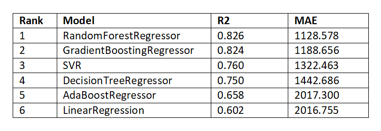

# Flight Price Prediction


## Introduction

The objective of this study is to analyze a flight booking dataset obtained from the "Ease My Trip" website and perform various statistical hypothesis tests to extract meaningful insights. We will employ multiple machine learning models to train on the data and predict a continuous target variable specifically, the price of flights.

"Ease My Trip" is an online platform where potential passengers can book flight tickets, making it a valuable source of data for understanding factors that influence ticket prices. By conducting a comprehensive analysis of the dataset, we aim to uncover insights that will be of significant value to passengers, helping them make more informed booking decisions.

The dataset, available on [kaggle.com](https://www.kaggle.com/datasets/jillanisofttech/flight-price-prediction-dataset/data), will be thoroughly examined to identify the features that have the greatest impact on flight prices. This study seeks to reveal the key determinants of flight costs, providing actionable information for both consumers and industry stakeholders.

In this study, we will employ a range of supervised regression machine learning models, including Decision Tree Regressor, Random Forest Regressor, Linear Regression, Gradient Boosting Regressor, and AdaBoost Regressor. Our approach will involve systematically searching for the most effective model by optimizing each model's hyperparameters through rigorous experimentation.

We will utilize techniques such as grid search and cross-validation to identify the optimal hyperparameter settings for each model. By evaluating the performance of these models on our dataset, we aim to determine the model that delivers the best predictive accuracy and generalization capability. The culmination of this research will be the identification of the top-performing model, along with its tuned hyperparameters, which will be recommended for practical implementation in relevant applications.

## Data Preparation

To prepare the data for use in our model, it must be transformed into the appropriate format. Many of the columns in the dataset are initially provided as strings, so it is necessary to extract the relevant information and convert it into numerical format.

1. **Missing Values**: Missing values will be replaced with appropriate estimated values.

2. **Time Data**: Time-related information will be extracted and split into separate hour and minute features.

3. **Date Data**: The date column will be decomposed into day of the month, month of the year, and year features to capture temporal patterns.

4. **Categorical Data**: The source and destination cities will be one-hot encoded to create binary indicators for each city, facilitating their use in the model.

5. **Airline Data**: Airlines will be encoded using target guided ordinal encoding, where each airline is assigned a numerical value based on its average price, enabling the model to capture the relationship between airlines and pricing.

6. **Feature Selection**: Uninformative features, either those with repetitive data or a large number of missing entries, will be removed from the dataset to reduce noise and improve model performance.

7. **Outlier values**: Outliers will be replaced with the median of their feature values. This ensures that the dataset remains robust to extreme values, reducing their potential impact on the model while preserving the overall distribution of the data. By using the median, which is less sensitive to outliers than the mean, we maintain the integrity of the data and enhance the model's stability and accuracy.

8. **Normalization**: Before feeding the data into our model, it will be normalized using the `StandardScaler` to ensure that all features have a consistent scale, leading to more efficient and stable training. 


## Modeling

In this section, we will focus on identifying and developing a model that effectively fits our data and provides accurate predictions. To evaluate the performance of the models, we will employ two key metrics: the coefficient of determination, R2 and the Mean Absolute Error (MAE).

To optimize each model's performance, we will utilize GridSearchCV to conduct an exhaustive search for the best hyperparameters. The selection of the optimal hyperparameters will be based primarily on the R2. Once the best hyperparameters are determined, we will also calculate and report the Mean Absolute Error for each model to provide a comprehensive comparison of their predictive accuracy.

The results of this analysis, including the corresponding performance metrics, are summarized in the following table:



## Final model

The Random Forest Regressor model achieved the highest performance among all the regression models, with a minimum Mean Absolute Error (MAE) of 1128.578. This low error indicates that the predicted prices deviate, on average, by only 1128.578 units from the actual values.

In practical terms, this MAE corresponds to approximately 12% of the mean price across the entire dataset, demonstrating the model's ability to make predictions that are closely aligned with the true prices. This level of accuracy highlights the Random Forest Regressor's effectiveness in capturing the underlying patterns in the data, making it a robust choice for price prediction in this context.

## Final remarks

It is important to acknowledge that the results obtained in this study are not definitive; alternative approaches with different hyperparameter tuning could lead to varying outcomes. As such, the findings presented here should be viewed as relative rather than absolute, reflecting the specific methodologies and data used.

To further enhance the accuracy and reliability of the model, we recommend expanding the dataset to include more comprehensive information, particularly data spanning all seasons of the year. By incorporating seasonal variations, the model would be better equipped to capture the full range of patterns and trends, leading to more precise and dependable predictions. This broader dataset would likely improve the model's generalizability and make the results more robust across different contexts.


## Repository Structure

```
├── Images: All the images including the one for README
├── Notebook: Main Notebook
├── PDFs: PDF files of the notebook and Presentation
├── Data : data used for modeling
├── README.md : project information and repository structure
```


